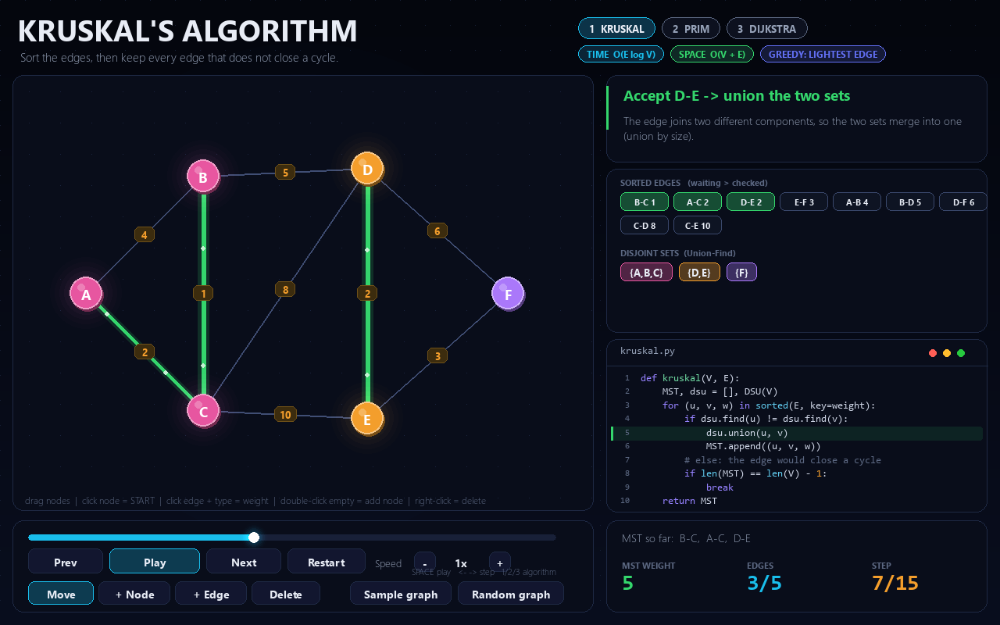
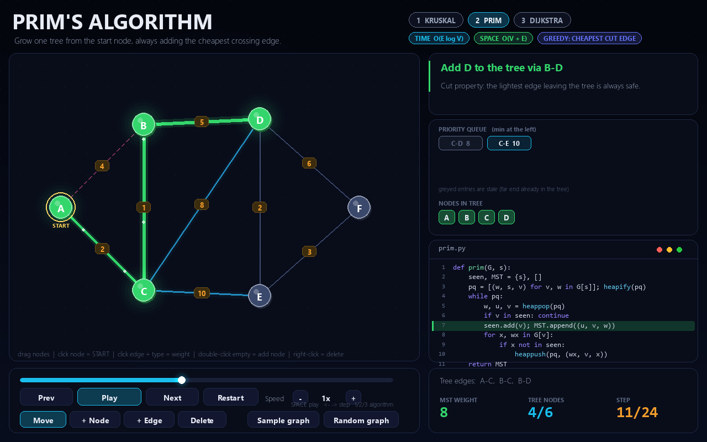
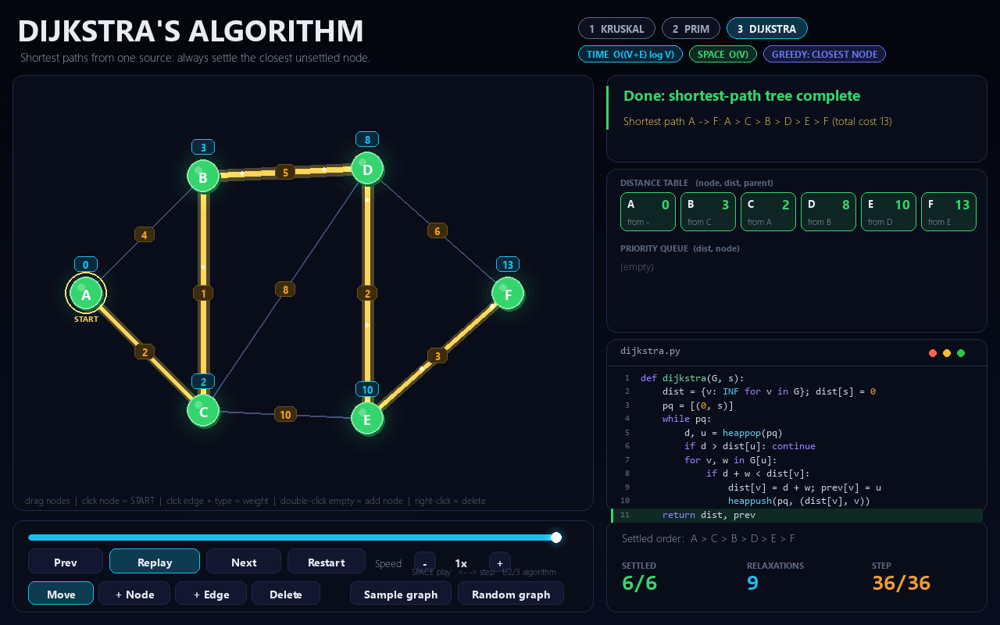

# Greedy Graph Lab

An interactive, step-by-step visualiser for three greedy graph algorithms from the DAA syllabus (Unit 3):

| Algorithm | Solves | Time | Space |
|---|---|---|---|
| Kruskal's | Minimum spanning tree | O(E log V) | O(V + E) |
| Prim's | Minimum spanning tree | O(E log V) | O(V + E) |
| Dijkstra's | Single-source shortest paths | O((V + E) log V) | O(V) |

Each step shows the greedy choice, the data structure in use (Union-Find sets or a priority queue), the line of code being executed, and a short explanation.

## Screenshots (desktop version)





## Run the web app (Streamlit)

```bash
pip install -r requirements.txt
streamlit run app.py
```

- Pick an algorithm in the sidebar, then use **Play**, **Prev**, **Next** or the step slider.
- **Drag the nodes** to rearrange the graph.
- Switch between the sample graph and a random graph, choose the start node, and edit edge weights in the table (rows can be added or deleted).
- After Dijkstra finishes, choose a node to trace its shortest path.

## Run the desktop version (pygame)

A second front end with a full graph editor (add and delete nodes and edges):

```bash
pip install pygame-ce
python greedy_graph_lab.py
```

Keys: `1`/`2`/`3` algorithm, `Space` play/pause, `Left`/`Right` step, `R` restart, `N` random graph, `G` sample graph.

## How it works

1. `algorithms.py` runs the real algorithm once and records a snapshot after every action: the colour of each node and edge, the data structure contents, the code line and an explanation.
2. `app.py` (web) and `greedy_graph_lab.py` (desktop) replay those snapshots, so you can pause, step forward or backward, or jump to any step.

## Project structure

```
app.py                Streamlit web app
canvas_component/     small HTML/JS component that makes the nodes draggable
algorithms.py         Kruskal, Prim, Dijkstra with step recording (no GUI code)
greedy_graph_lab.py   pygame desktop version
requirements.txt      dependencies of the web app
screenshots/          images used in this README
blog/                 the accompanying blog post (text and Blogger HTML)
```

## Limitations

- In the web app, nodes cannot be added or deleted (edges and weights can); the desktop version has a full graph editor.
- Up to 12 nodes and 24 edges; weights are whole numbers from 1 to 99.
- Dijkstra does not support negative weights.

Author: Lucky
